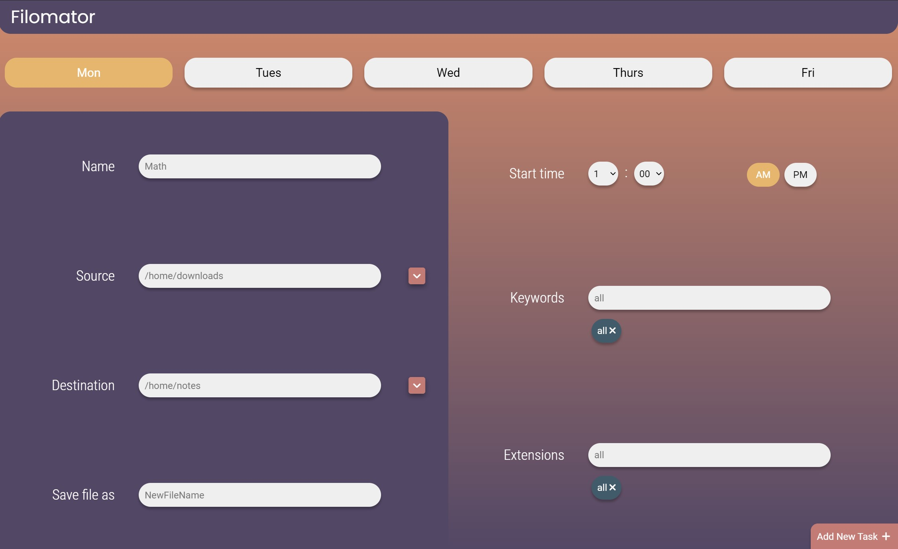

# Filomator
Automated File Management System

Backend: Python

GUI: Electron.js

## HOW TO RUN
1. Install npm and node.js on your system
2. Navigate to the ui folder in the command line
3. Run `npm install` in the command line to get the node packages
4. Run `npm start` to load and open the electron window.
5. Enter all the information. The selected days of the week will be shown in yellow. The Source and Destination folders
   can be chosen by clicking the square button to the right which opens the file explorer. Click on the dropdowns for 
   start time to select the hour and minute, and select whether the time is in AM or PM. Keywords and Extensions can be 
   chosen by typing in the input sections and clicking the `Enter` key, they will then show up below in green. You can 
   remove any keywords or extensions simply by clicking on them.
   
6. Once the task has been successfully added, navigate to the ../model folder in the command line.
7. Run `python main.py` in the command line. The program will now automate file management.
